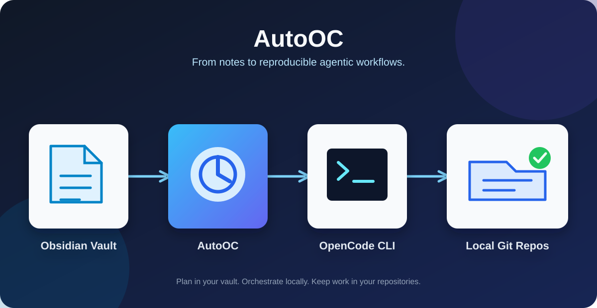

# AutoOC for Obsidian



AutoOC is a desktop-only Obsidian plugin for scheduling and running OpenCode CLI tasks and visual workflows from an Obsidian vault.

## What It Does

- Create OpenCode tasks with manual, one-time, daily, weekly, monthly, or interval schedules.
- Run tasks manually, monitor their status and output, keep logs, configure timeouts, and stop running work.
- Load available OpenCode models and agents, launch an OpenCode CLI session, and run a diagnostic from Obsidian.
- Build workflows in the embedded Visual Builder or classic view. Workflows support task, delay, and JavaScript code steps; default, forced, conditional, and AI-evaluated transitions; and branching paths.
- Import and export task and workflow packages as JSON, and use the included library packages as examples.
- Store secrets separately from plugin settings. When Electron secure storage is available, secret values are encrypted locally; AutoOC injects them only into OpenCode processes it launches and redacts known secret values of four or more characters from stored output.

## Requirements

- Obsidian Desktop with Community plugins enabled.
- OpenCode installed locally and available as `opencode`, or configured in AutoOC settings.
- Windows for the current background task launcher.
- `uv` only when using the optional local `autooc-mcp` helper.

## Install

### From a release

Download a release package and place its contents in `<vault>/.obsidian/plugins/auto-oc/`. The plugin directory must contain `manifest.json`, `main.js`, and `styles.css`.

Reload Obsidian, then enable **AutoOC — OpenCode Task Scheduler** in **Settings > Community plugins**.

### Local development

```powershell
npm install
npm run build
node deploy.mjs "C:/path/to/your/vault"
```

`node deploy.mjs` copies the already-built `manifest.json`, `main.js`, and `styles.css` artifacts to `<vault>/.obsidian/plugins/auto-oc/`. Run `npm run build` first, as shown above. Reload Obsidian after deploying. Use `npm run dev` for iterative bundling or `npm run build` for a production build.

For iterative bundling, run:

```powershell
npm run dev
```

## Use AutoOC

1. Open the AutoOC panel from its ribbon icon or command palette command.
2. Create a task, select an OpenCode model and schedule, then save it.
3. Choose **Run** to execute immediately or let the scheduler run it when due.
4. Review output and logs in the panel; use **Stop** to cancel an active task.

AutoOC runs OpenCode as a local external process. Tasks and workflows are saved through Obsidian's plugin data in the vault; optional secrets are stored separately in the plugin folder. See the [architecture](docs/architecture.md) for runtime and data-flow details.

## Visual Builder

Open the command palette and select `Open AutoOC Visual Builder`. The modal is titled `✨ WF Visual Builder`. Build workflows with task, delay, and JavaScript code steps, then connect them with transitions to create DAG branches. The embedded builder validates and applies workflow state to AutoOC; import and export workflow JSON remain in the classic AutoOC panel.

The classic AutoOC view and Visual Builder edit the same tasks and workflows. Use either surface for the workflow that best fits the job.

## Ralph Loop

For tasks that should continue until their completion criteria are met, enable Ralph Loop in the task editor. AutoOC prefixes the task prompt with `/ralph-loop`; the OpenCode Ralph Loop stops when it emits `<promise>DONE</promise>` or reaches its maximum iterations. Make the done criteria explicit in the prompt. Set it up from the command palette with `AutoOC: Ralph Loop Assistant (install/activate)`, then restart OpenCode.

## Secrets And AutoOC MCP

Secrets are kept outside Obsidian plugin settings at `<vault>/.obsidian/plugins/auto-oc/secrets.vault.json`. The optional PIN controls reveal, edit, and delete access; it is not the encryption key. AutoOC preserves user-entered secret display names; only the injected environment variable is normalized as `AUTOOC_*`. Secret values are injected only into the OpenCode child processes AutoOC starts.

The optional `autooc-mcp` helper makes secret metadata and credential lookup available to OpenCode agents. Secret values are available only to OpenCode launched by AutoOC, which inherits them through the task process; manually launched OpenCode can see metadata but not values. Install [`uv`](https://docs.astral.sh/uv/) first, then use **Install autooc-mcp in OpenCode** in AutoOC's Secrets view and restart OpenCode. For MCP configuration details, use the canonical [OpenCode MCP documentation](https://opencode.ai/docs/mcp-servers/); implementation and data-flow details are in the [architecture](docs/architecture.md).

## Diagnostics And Troubleshooting

Run `AutoOC: Diagnostic — test opencode command` from the command palette to check the configured OpenCode command. For setup failures, task launch problems, or timeouts, review the [architecture](docs/architecture.md) and verify the configured OpenCode command, task timeout, and plugin files under `.obsidian/plugins/auto-oc/`.

## Development

```powershell
npm test
npm run build
```

`npm test` runs the repository's Node test suite. The build first inlines the Visual Builder, type-checks TypeScript, and bundles the Obsidian plugin. The primary source is `main.ts`; edit `util/ui_workflow_builder/index.html` for the standalone builder. Its generated embed is refreshed by the development and build scripts.

The commands in this README are the authoritative command reference. See the [development harness](docs/development-harness.md) for implementation and contributor-workflow architecture, including generated-file relationships and quality gates.

## Release Artifacts

Create a distributable ZIP containing `manifest.json`, `main.js`, and `styles.css`:

```powershell
npm run build
npm run pack:release
```

The package is written to `release/auto-oc-<version>.zip` and the script prints its SHA-256 hash. Release packages and in-app updates require `manifest.json`, `main.js`, and `styles.css`. See the [release workflow](RELEASE_WORKFLOW.md), [publication checklist](PUBLISH_CHECKLIST.md), and [changelog](CHANGELOG.md).

## Contributing

Contributions, bug reports, and workflow ideas are welcome. Preserve these invariants:

- Keep the classic AutoOC UI and Visual Builder consistent.
- Preserve task and workflow import/export compatibility, migrations, and JSON round trips when changing persisted workflow data.
- Regenerate Visual Builder output and release assets when their sources change.
- Run `npm test` and `npm run build` before submitting changes.

Start with the [architecture](docs/architecture.md) and the [development harness](docs/development-harness.md), which describes contributor workflow architecture rather than replacing this README's command reference.

## License

AutoOC is open source under the [MIT License](LICENSE).
