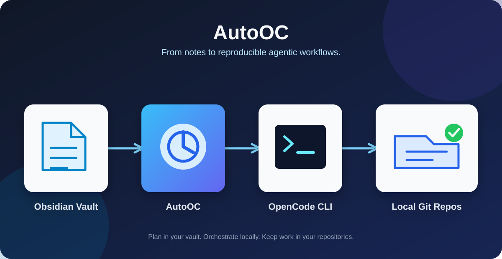

# AutoOC for Obsidian



AutoOC is a desktop-only Obsidian plugin for scheduling and running OpenCode, Codex, and GitHub Copilot CLI tasks and visual workflows from an Obsidian vault.

## What It Does

- Create OpenCode tasks with manual, one-time, daily, weekly, monthly, or interval schedules.
- Run tasks manually, monitor their status and output, keep logs, configure timeouts, and stop running work.
- Load available OpenCode models and agents, launch an OpenCode CLI session, and run a diagnostic from Obsidian.
- Build workflows in the embedded Visual Builder or classic view. Workflows support task, delay, and JavaScript code steps; default, forced, conditional, and AI-evaluated transitions; and branching paths.
- Import and export task and workflow packages as JSON, and use the included library packages as examples.
- Store secrets separately from plugin settings. When Electron secure storage is available, secret values are encrypted locally; AutoOC injects them only into OpenCode processes it launches and redacts known secret values of four or more characters from stored output.

## Requirements

- Obsidian Desktop with Community plugins enabled.
- The CLI for your chosen engine installed and authenticated: OpenCode, Codex, or GitHub Copilot CLI.
- Windows, macOS, or Linux.

## Install

### From a release

Descarga el ZIP de la versión publicada y extrae su contenido en `<vault>/.obsidian/plugins/auto-oc/`. Debe contener los siete archivos: `main.js`, `manifest.json`, `styles.css`, `autooc-cli.cjs`, `autooc-runtime.cjs`, `skills/autooc-runtime/SKILL.md` y `release-integrity.json`. El paquete completo puede arrancar sin red.

Desde 1.6.0, usa la actualización del propio plugin. Al recibir los tres archivos del actualizador antiguo, el nuevo `main.js` completa automáticamente el paquete antes de habilitar ejecuciones. Necesita red para ese primer completado y exige la misma versión y los mismos bytes del bundle. Un fallo de red o integridad informa del problema y permite reintentar; una transacción incierta conserva su marcador y respaldo y bloquea ejecución. No borres reservas ni journals para forzar la carga. Esta corrección solo estará disponible por actualización pública cuando se publique la versión 1.6.2; prepararla en esta rama no acredita su publicación.

La recarga espera de forma acotada a que termine una escritura del catálogo iniciada por la vista antigua, tanto la escritura directa de 1.6.0 como el guardado atómico de 1.6.1. En este último caso observa la cola de guardados: solo admite un nuevo lock cuando ha comprobado que un temporal del guardado anterior pasó a ser el catálogo por renombrado atómico. Los avisos del directorio adelantan las comprobaciones, sin sustituirlas. Una transición no observada o incierta bloquea; tras terminar exige datos válidos y estables y fija su identidad. Un lock persistente, sustituido o inseguro, un cambio posterior del catálogo o efectos pendientes detienen el arranque sin sustituir datos por valores vacíos. Conserva la evidencia y el diagnóstico; no borres una reserva para forzar el reintento.

Reload Obsidian, then enable **AutoOC — OpenCode Task Scheduler** in **Settings > Community plugins**.

Si Obsidian usa una carpeta de configuración personalizada, instala el plugin en `<vault>/<configDir>/plugins/auto-oc/`. Las tareas y workflows compartidos usan el catálogo, la reserva, el journal, la recuperación y las aprobaciones de esa instalación. Si cambias la selección con una reserva activa, AutoOC rechaza la discrepancia: termina o reconcilia la ejecución y recarga Obsidian. La CLI conserva `.obsidian/plugins/auto-oc` como ubicación predeterminada; no busca otras instalaciones.

### Local development

```powershell
npm install
npm run build
node deploy.mjs "C:/path/to/your/vault"
```

`node deploy.mjs` copia los siete artefactos ya compilados a `<vault>/.obsidian/plugins/auto-oc/`, conservando configuración e historial. Ejecuta antes `npm run build` y descarga el plugin sin ejecuciones pendientes. Usa `npm run dev` para compilación iterativa y `npm run build` para generar el paquete verificable.

For iterative bundling, run:

```powershell
npm run dev
```

## Use AutoOC

1. Open the AutoOC panel from its ribbon icon or command palette command.
2. Create a task, select an OpenCode model and schedule, then save it.
3. Choose **Run** to execute immediately or let the scheduler run it when due.
4. Review output and logs in the panel; use **Stop** to cancel an active task.

AutoOC runs OpenCode as a local external process. Tasks and workflows are saved through Obsidian's plugin data in the vault; optional secrets are stored separately in the plugin folder. See the [architecture](docs/architecture.md) for runtime and data-flow details.

### GitHub Copilot CLI

1. Install [GitHub Copilot CLI](https://docs.github.com/en/copilot/how-tos/copilot-cli/set-up-copilot-cli) and sign in from a terminal using `copilot login`. Your account and organization must permit Copilot CLI access.
2. In AutoOC settings, use **Copilot executable path → Detect & test**. The default `copilot` detects the local installation, including the native executable bundled by npm on Windows. You can also specify an absolute executable path. This check verifies the installation; account access is checked when a task runs.
3. Create a **GitHub Copilot CLI task** in the classic editor or Visual Builder. Enter its prompt, project folder and schedule. Optionally enter a model ID available to your account (`/model` in Copilot lists them). Empty uses AutoOC's **Default Copilot model**, then the CLI default.
4. Tasks expose only file reading and search tools by default. Enable **Allow tools automatically** on a task to let Copilot edit files and run commands without asking. Folder and URL permissions still follow Copilot's policy. This permission is included in exported packages, so review it before running imported tasks.
5. Run the task and follow its output in AutoOC. **Stop**, timeouts, recurring schedules, saved logs, and workflow output handoff are supported. Copilot tasks can share a workflow with OpenCode, Codex and JavaScript steps.

Copilot tasks run in the background using the selected folder's currently checked-out branch. They do not open an interactive terminal, use OpenCode agents/Ralph Loop, or change branches automatically. AI-evaluated workflow transitions still use the existing OpenCode evaluator. Long prompts use a temporary UTF-8 instruction file that is removed when the task ends. AutoOC injects its configured secrets into the child process and redacts known secret values from displayed and saved output.

Exports containing Copilot tasks use schema `1.6.0` and `taskKind: "copilot"`; older schemas remain supported. As with other engines, exported packages use the importing system's default model. See the included [Copilot example](library/copilot-code-review.json).

If a task reports **Access denied by policy settings**, check your [Copilot account settings](https://github.com/settings/copilot) and organization policy. AutoOC cannot override GitHub's access restrictions.

## Visual Builder

Open the command palette and select `Open AutoOC Visual Builder`. The modal is titled `✨ WF Visual Builder`. Build workflows with task, delay, and JavaScript code steps, then connect them with transitions to create DAG branches. The embedded builder validates and applies workflow state to AutoOC; import and export workflow JSON remain in the classic AutoOC panel.

The classic AutoOC view and Visual Builder edit the same tasks and workflows. Use either surface for the workflow that best fits the job.

## Ralph Loop

For tasks that should continue until their completion criteria are met, enable Ralph Loop in the task editor. AutoOC prefixes the task prompt with `/ralph-loop`; the OpenCode Ralph Loop stops when it emits `<promise>DONE</promise>` or reaches its maximum iterations. Make the done criteria explicit in the prompt. Set it up from the command palette with `AutoOC: Ralph Loop Assistant (install/activate)`, then restart OpenCode.

## Secrets And AutoOC MCP

Secrets are kept outside Obsidian plugin settings at `<vault>/.obsidian/plugins/auto-oc/secrets.vault.json`. The optional PIN controls reveal, edit, and delete access; it is not the encryption key. AutoOC preserves user-entered secret display names; only the injected environment variable is normalized as `AUTOOC_*`. Secret values are injected only into the OpenCode child processes AutoOC starts.

El puente MCP local se retira en 1.6.2 para eliminar su carrera de arranque y descarga. AutoOC no modifica configuraciones ni credenciales de otros clientes. La ejecución autónoma sigue disponible con la CLI y la [skill distribuida](skills/autooc-runtime/SKILL.md). El almacén de credenciales existente se conserva.

## CLI con Obsidian abierto

En un paquete que indique `pluginRequests: 1` al consultar `version`, la CLI puede pedir al plugin abierto que ejecute una tarea o workflow. Abre el Dashboard para ver su progreso y resultados. Se usan los mismos comandos:

```powershell
node "C:/ruta/vault/.obsidian/plugins/auto-oc/autooc-cli.cjs" run --vault "C:/ruta/vault" --task ID_TAREA
node "C:/ruta/vault/.obsidian/plugins/auto-oc/autooc-cli.cjs" run --vault "C:/ruta/vault" --workflow ID_WORKFLOW
```

El plugin y la CLI deben pertenecer al mismo paquete compatible. Con Obsidian abierto, el plugin mantiene la reserva y ejecuta la petición; con el plugin descargado y sin reserva, la CLI ejecuta directamente. El resultado final es JSON por stdout y el progreso delegado se informa por stderr. No se habilitan ejecuciones simultáneas ni se abre ningún puerto de red. Cerrar solo el Dashboard no detiene la tarea.

Para observar la ejecución en el Dashboard, carga AutoOC antes de lanzar la CLI. Si la CLI ya está ejecutando autónomamente, abrir Obsidian no transfiere esa ejecución al plugin: la reserva sigue protegida hasta terminar o reconciliar.

Desde 1.6.7, el Live Log de OpenCode no interactivo muestra la respuesta y la traza mientras el proceso sigue trabajando, tanto si se inicia desde Obsidian como desde la CLI. La salida intermedia es temporal; el resultado final se guarda al terminar.

`stop`, `resume` y `reconcile` conservan el ID de ejecución. Si se interrumpe la espera o se cierra Obsidian, consulta `status` y el recibo indicado antes de repetir; una entrega incierta nunca se convierte automáticamente en otra ejecución. Esta capacidad preparada en el repositorio no acredita su publicación o instalación.

## Diagnostics And Troubleshooting

Run `AutoOC: Diagnostic — test opencode command` from the command palette to check the configured OpenCode command. For setup failures, task launch problems, or timeouts, review the [architecture](docs/architecture.md) and verify the configured OpenCode command, task timeout, and plugin files under `.obsidian/plugins/auto-oc/`.

## Development

```powershell
npm test
npm run build
```

`npm test` runs the repository's Node test suite. The build first inlines the Visual Builder, type-checks TypeScript, and bundles the Obsidian plugin. The primary source is `main.ts`; edit `util/ui_workflow_builder/index.html` for the standalone builder. Its generated embed is refreshed by the development and build scripts.

The commands in this README are the authoritative command reference for implementation, contributor workflow, generated-file relationships, and quality gates.

## Release Artifacts

Crea el ZIP distribuible con los siete archivos enumerados en Instalación:

```powershell
npm run build
npm run pack:release
```

El paquete se guarda en `release/auto-oc-<version>.zip` y el script imprime su SHA-256. El descriptor verifica los seis artefactos restantes, su versión y sus hashes. Consulta el [workflow de publicación](RELEASE_WORKFLOW.md), la [lista de comprobaciones](PUBLISH_CHECKLIST.md) y el [changelog](CHANGELOG.md).

## Contributing

Contributions, bug reports, and workflow ideas are welcome. Preserve these invariants:

- Keep the classic AutoOC UI and Visual Builder consistent.
- Preserve task and workflow import/export compatibility, migrations, and JSON round trips when changing persisted workflow data.
- Regenerate Visual Builder output and release assets when their sources change.
- Run `npm test` and `npm run build` before submitting changes.

Start with the [architecture](docs/architecture.md).

## License

AutoOC is open source under the [MIT License](LICENSE).
