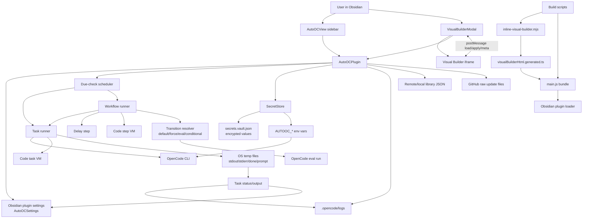

# Architecture

## High-Level Overview

AutoOC is an Obsidian desktop plugin that schedules, runs, and monitors OpenCode CLI tasks from inside an Obsidian vault. The plugin is implemented primarily in `main.ts`, bundled into `main.js`, and loaded by Obsidian using `manifest.json`.

The system has three main runtime surfaces:

- The Obsidian sidebar view (`AutoOCView`) for dashboard, tasks, workflows, secrets, logs, imports, exports, and controls.
- The plugin controller (`AutoOCPlugin`) that owns settings, scheduling, task execution, workflow execution, secrets, updates, and integrations.
- The Visual Builder (`util/ui_workflow_builder/index.html`) embedded as generated HTML in an iframe modal for visual workflow editing.

At runtime, Obsidian persists plugin settings through `loadData()` / `saveData()`. Secrets are stored separately in the vault plugin folder at `.obsidian/plugins/auto-oc/secrets.vault.json` and encrypted with Electron secure storage when available.

The plugin launches OpenCode as an external process. On Windows, non-interactive tasks are launched through temporary PowerShell scripts started by `wscript.exe` so execution is detached from Electron and does not show a console window. Output is written to temporary files, polled by the plugin, redacted, stored in settings, and optionally copied to `.opencode/logs/<taskId>/`.

## Main Components

- `AutoOCPlugin` in `main.ts`: the central plugin class. It loads and migrates settings, registers Obsidian commands and views, schedules due checks, launches tasks, runs workflows, manages Visual Builder synchronization, installs Ralph Loop / `autooc-mcp`, checks for updates, and saves state.
- `AutoOCView` in `main.ts`: the Obsidian `ItemView` used for the user interface. It renders dashboard, tasks, workflows, secrets, logs, and action buttons. It delegates mutations and execution to `AutoOCPlugin`.
- Task model: `ScheduledTask` describes either an OpenCode task or a reusable JavaScript code task. It includes prompt/code, model, agent, schedule, status, output, working directory, branch options, and optional terminal/file/vault permissions for code tasks.
- Workflow model: `Workflow` contains `WorkflowStep` nodes. Steps can be `task`, `delay`, or `code`. Step transitions can be `default`, `force`, `eval`, or `conditional`, which makes workflows DAG-like rather than strictly linear.
- Workflow runner: `runWorkflow()`, `runWorkflowStepById()`, `runWorkflowStep()`, `runTaskStep()`, `runDelayStep()`, `runCodeStep()`, `completeStep()`, and `resolveNextStep()` coordinate step execution and route to the next step.
- Task runner: `runTask()` launches OpenCode tasks or delegates to `runCodeTask()` for local JavaScript code tasks. Non-interactive OpenCode output is collected through temporary files.
- Code execution sandbox: code tasks and code workflow steps use Node `vm.runInContext()`. Optional APIs expose vault-local file operations, broader filesystem operations, and terminal execution when the task/step explicitly enables them.
- `SecretStore` in `main.ts`: loads, saves, encrypts, decrypts, lists, and redacts local secrets. It also builds environment variables injected into OpenCode child processes.
- Visual Builder modal: `VisualBuilderModal` embeds the generated Visual Builder HTML through `iframe.srcdoc`, sends current tasks/workflows via `postMessage`, receives edited state back, and smart-merges it into plugin settings while preserving runtime status/output fields.
- Standalone Visual Builder: `util/ui_workflow_builder/index.html` is a self-contained HTML/CSS/JS workflow editor. `scripts/inline-visual-builder.mjs` embeds it into `visualBuilderHtml.generated.ts` before build/dev.
- Build and packaging scripts: `esbuild.config.mjs` bundles `main.ts` to CommonJS `main.js`; `deploy.mjs` copies plugin files into an Obsidian vault; `package-release.ps1` creates release zips.
- Library files: `library/index.json` and sibling JSON files provide importable sample/task workflow packages fetched from the repository URL configured in settings.

## Repository Structure

```text
.
├─ main.ts                         # Primary TypeScript source for plugin logic and UI
├─ main.js                         # Built plugin bundle loaded by Obsidian
├─ manifest.json                   # Obsidian plugin metadata
├─ styles.css                      # Plugin styles loaded by Obsidian
├─ package.json                    # npm scripts and dev dependencies
├─ tsconfig.json                   # TypeScript compiler options
├─ esbuild.config.mjs              # Bundle configuration
├─ deploy.mjs                      # Local vault deployment helper
├─ package-release.ps1             # Release zip helper
├─ scripts/
│  └─ inline-visual-builder.mjs    # Embeds Visual Builder HTML into TypeScript
├─ util/ui_workflow_builder/
│  └─ index.html                   # Standalone Visual Builder app
├─ visualBuilderHtml.generated.ts  # Generated embedded Visual Builder source
├─ library/                        # Importable task/workflow library metadata and examples
├─ release/                        # Built release zip artifacts
└─ docs/                           # Project documentation
```

The project does not currently use a `src/` directory. Most runtime code lives in one large `main.ts` file.

## Core Flow

1. Obsidian loads `main.js` using `manifest.json`.
2. `AutoOCPlugin.onload()` calls `loadSettings()`, initializes the secret store, registers the sidebar view, commands, ribbon icon, settings tab, scheduler interval, delayed startup check, and background update check.
3. The scheduler calls `runDueAll()` every 5 seconds and once after layout readiness. It finds due tasks and workflows with schedule helpers.
4. A user or scheduler starts a task with `runTask()`.
5. If the task is an OpenCode task, the plugin builds OpenCode arguments, injects decrypted secrets as temporary environment variables, launches the process, polls temp files, redacts secret values, updates task status/output, and writes logs if enabled.
6. If the task is a code task, `runCodeTask()` executes JavaScript in a `vm` sandbox and updates the task state from the returned output variable.
7. A user or scheduler starts a workflow with `runWorkflow()`.
8. The workflow runner finds an entry step, tracks per-step runtime output in an in-memory `workflowRuntime` map, executes each step by kind, then resolves the next step using transitions.
9. UI views and Visual Builder modals are refreshed or synchronized after mutations so both editing surfaces reflect the same settings model.

## Data Flow

```text
Obsidian settings storage
  -> AutoOCSettings
  -> AutoOCView / VisualBuilderModal
  -> user edits tasks and workflows
  -> AutoOCPlugin.saveSettings()
  -> Obsidian settings storage

Task execution
  -> ScheduledTask
  -> OpenCode args or VM sandbox
  -> temp files / sandbox result
  -> redaction and normalization
  -> ScheduledTask.output/status
  -> optional .opencode/logs/<taskId>/latest.log

Workflow execution
  -> Workflow.steps
  -> runtime stepOutputs map
  -> task/delay/code step output
  -> transition resolver
  -> next step or workflow completion

Secrets
  -> SecretStore
  -> secrets.vault.json encrypted values
  -> decrypted in memory only when needed
  -> injected as AUTOOC_* environment variables into OpenCode processes
  -> redaction pass before output is stored
```

Settings are the canonical persisted state for tasks, workflows, runtime status, outputs, dashboard positions, OpenCode defaults, scheduling, logs, and library URL. Secrets intentionally live outside settings.

## External Dependencies

- Obsidian plugin API: provides `Plugin`, `ItemView`, `Modal`, `PluginSettingTab`, `Notice`, settings persistence, workspace views, vault adapter writes, and UI primitives.
- Electron secure storage: accessed through `safeStorage` for encrypting/decrypting secrets when available.
- Node built-ins: `child_process`, `fs`, `path`, `os`, `crypto`, and `vm` are used heavily for process launch, file access, paths, secret PIN hashing, and sandboxed code execution.
- OpenCode CLI: the primary external execution engine. The plugin expects `opencode` or a configured binary path and calls commands such as `opencode models`, `opencode agent list`, and `opencode run`.
- Ralph Loop: optional OpenCode plugin installed by editing `~/.config/opencode/opencode.json` and adding `opencode-ralph-loop`.
- `uv`: optional dependency needed to run the generated `autooc-mcp.py` FastMCP helper script.
- FastMCP / Python MCP runtime: used by the generated `autooc-mcp` helper, which exposes secret metadata and credential lookup tools to agents.
- GitHub raw URLs: used for update checks, self-update downloads, and the default workflow/task library URL.
- Build-time dev dependencies: TypeScript, esbuild, Obsidian types, `builtin-modules`, `tslib`, and Node types.

## Configuration Model

Configuration is represented by the `AutoOCSettings` interface in `main.ts` and persisted by Obsidian through `loadData()` / `saveData()`.

Main settings include:

- `tasks`: array of `ScheduledTask` records.
- `workflows`: array of `Workflow` records.
- `opencodePath`: OpenCode binary path, defaulting to `opencode`.
- `defaultModel` and `defaultAgent`: defaults selected from dynamically loaded OpenCode models and agents.
- `workingDirectory`: default execution directory; falls back to the vault base path.
- `cmdTemplate`: legacy/preview command template field.
- `taskTimeoutSeconds`: soft timeout warning threshold, default 7200 seconds.
- `defaultInteractiveTerminal`: default for opening interactive CLI sessions.
- `logsEnabled`, `maxLogsPerTask`, and `logRetentionDays`: file log controls.
- `libraryUrl`: base URL for importable library packages.
- `dashboardPositions`: persisted UI layout metadata.

`loadSettings()` also performs migration and cleanup: stale `running` tasks/workflows are marked failed, missing schedule fields are added, legacy linear workflow steps receive IDs/transitions/positions, and missing defaults are filled.

Secrets use a separate `SecretsVault` schema in `.obsidian/plugins/auto-oc/secrets.vault.json`. Secret values are encrypted with Electron secure storage; the optional UI PIN controls reveal/edit/delete access but is not the encryption key.

Build configuration is separate:

- `package.json` scripts run the Visual Builder inlining step before dev/build.
- `esbuild.config.mjs` bundles `main.ts` to `main.js`, keeps Obsidian/Electron/CodeMirror/Node built-ins external, and emits CommonJS for Obsidian.
- `tsconfig.json` enables strict null checks, ESNext modules for TypeScript input, ES6/DOM libs, and bundler module resolution.

## Extension Points

- Add or change task fields by updating `ScheduledTask`, classic UI modals/views, Visual Builder payload handling, export/import, and migrations in `loadSettings()`.
- Add or change workflow fields by updating `Workflow`, `WorkflowStep`, Visual Builder templates/property panels, import/export schema, and migration logic.
- Add workflow step behavior by extending `StepKind` and dispatch logic in `runWorkflowStep()`, then adding corresponding Visual Builder support.
- Add transition behavior by extending `TransitionMode` and `resolveNextStep()`, then adding Visual Builder edge editing support.
- Add library content by adding JSON packages under `library/` and registering them in `library/index.json`.
- Add new settings by extending `AutoOCSettings`, `DEFAULT_SETTINGS`, `AutoOCSettingTab`, and any relevant migration/default handling.
- Add OpenCode integrations through the existing process-launch path, but preserve argument separation before `--` so prompt text is not parsed as CLI flags.
- Add MCP helper behavior by changing `getAutoOcMcpServerSource()` and the generated config block, while keeping secret values protected.

Important: the README states that new features must be implemented in both the classic list UI and the Visual Builder. Treat the data model as the source of truth and keep JSON import/export round-trips compatible.

## Important Technical Decisions

- Most code is in `main.ts`. This keeps the plugin compact but makes impact analysis important because UI, data model, execution, settings, and integrations are tightly coupled.
- Visual Builder is developed as standalone HTML, then embedded into the plugin at build time via `visualBuilderHtml.generated.ts`. This avoids runtime `file://` path issues and keeps the builder usable in a normal browser.
- Visual Builder communication uses `postMessage` between the iframe and plugin modal. The plugin smart-merges Visual Builder state to avoid wiping runtime status, last run data, output logs, and classic-only fields.
- Non-interactive OpenCode execution is detached through PowerShell/VBScript on Windows and uses temp-file polling. This avoids Electron job-object termination and console window flashes, but it makes cleanup and polling behavior sensitive.
- OpenCode CLI arguments are built as arrays and prompt text is placed after `--` to avoid prompt content being interpreted as CLI options.
- Workflows are DAG-capable. The entry step is inferred from missing incoming transitions, with visual `position.x` used as a tie-breaker.
- Code tasks and code steps use Node `vm` with explicit optional capabilities. Vault access is constrained to the vault root, but broader file and terminal access can be enabled per task/step.
- Secrets are separated from Obsidian settings and injected into child processes as temporary environment variables. Output redaction happens before task output is persisted.
- Updates are implemented in-plugin by downloading `main.js`, `manifest.json`, and `styles.css` from GitHub raw URLs and writing into the plugin folder.

## Sensitive or Risky Areas

- `main.ts` is large and cross-cutting. Small model changes can affect scheduling, UI rendering, Visual Builder, export/import, migrations, and execution.
- Workflow schema changes are risky. Update classic UI, Visual Builder, import/export schema/version, and `loadSettings()` migrations together.
- Visual Builder state merging is risky because it must preserve runtime state while accepting external iframe edits.
- Process launch code is risky because it handles shell quoting, temporary files, paths with spaces, branch commands, environment variables, and detached execution.
- Secret handling is sensitive. Do not log decrypted values, persist decrypted values, weaken redaction, or assume the UI PIN is the encryption key.
- Code task/step permissions are sensitive. `codeAllowFiles` and `codeAllowTerminal` intentionally allow broader access than vault-only APIs.
- Conditional and AI-evaluated workflow transitions can change control flow based on user code or model output. Changes should preserve failure behavior and timeouts.
- Update logic writes plugin files in the vault. Validate remote URLs, failure handling, and reload behavior carefully.
- `visualBuilderHtml.generated.ts` is generated. Edit `util/ui_workflow_builder/index.html`, then regenerate with the build/prebuild script.
- `main.js` is generated output for Obsidian. Source changes should be made in `main.ts` unless intentionally updating release artifacts.
- Automated tests use Node's built-in test runner; run `npm test` (`node --test`) before release. For risky changes, add the smallest executable check and perform relevant manual Obsidian/OpenCode verification.

## Architecture Diagram


