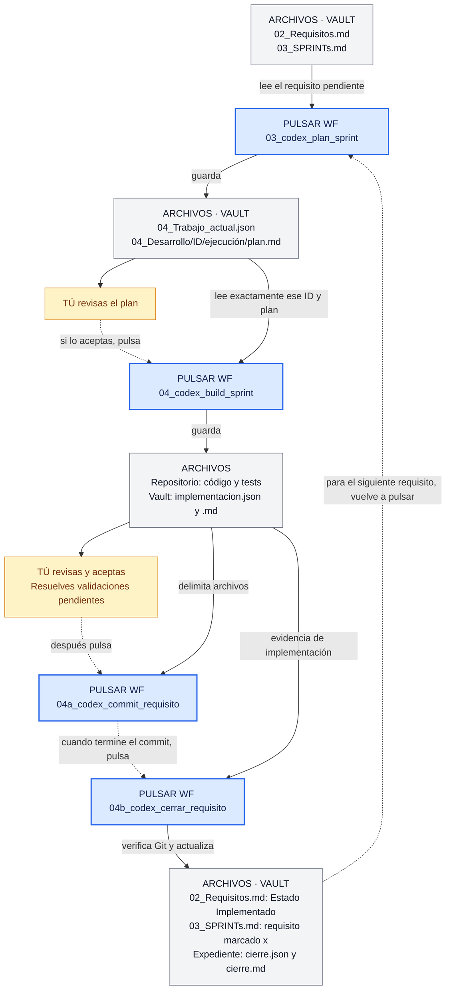

# SDLC Codex v2 — botones, archivos y cierre

Importa [sdlc-codex-background-app.json](sdlc-codex-background-app.json) en AutoOC y filtra por **Codex dev**. Contiene **10 tareas Codex y 12 workflows**. Configura el directorio del repositorio y el modelo Codex predeterminado en AutoOC.

Si ya importaste v1, importar este archivo no actualiza esos objetos: crea otros y puede añadir sufijos a nombres repetidos. Identifica y deja de usar los workflows anteriores para no mezclar ambos ciclos. No se modifica automáticamente tu configuración de AutoOC.

## Qué botón pulsar

Cada fila representa un lanzamiento manual. Espera a que termine antes de pasar al siguiente. Para el ciclo de un requisito, utiliza los botones de **Workflows**, no sus tareas internas.

| Orden | Botón en AutoOC | Entrada | Salida |
|---|---|---|---|
| 1 | WF `01_codex_enriquecer_entradas` | Quick notes, bugs/features, deuda, requisitos existentes y código | Añade nuevos requisitos a `02_Requisitos.md` y marca `[x]` únicamente las entradas fuente capturadas |
| 2 | WF `02_codex_generar_sprints` | Pendientes de `02_Requisitos.md` y código | Escribe `03_SPRINTs.md`; después marca `[x]` en `02` y registra `Estado: Priorizado en sprint` |
| 3 | WF `03_codex_plan_sprint` | Primer pendiente del sprint, su original y código | Guarda `plan.md` y fija ID/ejecución en `04_Trabajo_actual.json` |
| — | Tú revisas el plan guardado | `plan.md` | Si requiere ajustes, puedes repetir 03: replanifica el mismo ID y conserva el expediente anterior |
| 4 | WF `04_codex_build_sprint` | Estado activo y plan guardado, original y código | Modifica código/tests; guarda `implementacion.json` y `implementacion.md` |
| — | Tú revisas diff, validaciones y pruebas manuales pendientes | Código y `implementacion.md` | Implementación aceptada y evidencias disponibles |
| 4a | WF `04a_codex_commit_requisito` | Estado activo, resultado de implementación y diff real | Commit local limitado a los archivos del requisito |
| 4b | WF `04b_codex_cerrar_requisito` | Estado, plan, implementación, original y commits | Original marcado [x], copia retirada del sprint, `cierre.json` y `cierre.md` |
| 5 | WF `07_codex_plan_qa` | Cambios confirmados y CSV existente | Actualiza `qa/plan-de-pruebas.csv`, sin ejecutar casos |
| — | Tú ejecutas QA y registras resultados; usas la tarea `09_codex_commit_cambios_app` con alcance explícito si corresponde | CSV y correcciones | Cambios confirmados |
| 6 | WF `05_codex_pre_pr_review` | Diff/commits confirmados, código y tests | Escribe `05_Tasks_before_to_merge_main.md` |
| 7, si hay hallazgos | WF `06_codex_remediar_pre_pr` | Informe y código actual | Código/tests corregidos; después validar, commitear y repetir 05 |
| 8 | WF `08_codex_release_notes` | Git, requisitos e informe PRE-PR | Escribe `09_Release_notes.md` |

Después de 04b, vuelve a 03 para el siguiente requisito. No necesitas regenerar todos los sprints en cada cierre: 04b retira únicamente el bloque cerrado, preserva el orden restante y puede dejar encabezados de sprint vacíos. Usa 02 cuando quieras reagrupar los pendientes.

## Diagrama de los botones del ciclo de desarrollo

Los bloques azules son botones **WF** de AutoOC. Los grises son archivos y los amarillos, acciones tuyas. Las flechas no lanzan automáticamente el workflow siguiente.



## Archivos y fuente de verdad

Todas las rutas siguientes son relativas al **vault**, salvo código/tests y `qa/plan-de-pruebas.csv`, que pertenecen al **repositorio configurado**. Los archivos de desarrollo se crean al ejecutar los workflows; importar el JSON no los crea.

```text
Docs/autoOC/
├── 02_Requisitos.md                    # Maestro: [ ] sin priorizar; [x] enviado a sprint
├── 03_SPRINTs.md                       # Cola operativa: [ ] pendiente; [x] implementado
├── 04_Trabajo_actual.json              # ID, ejecución, raíz, rama, HEAD y etapa activa
├── 04_Desarrollo/
│   └── REQ-.../
│       └── run-.../                    # Un expediente por planificación
│           ├── plan.md                # Requisito literal + plan
│           ├── implementacion.json    # Archivos y validaciones estructuradas
│           ├── implementacion.md      # Resultado legible
│           ├── cierre.json            # Commits y aceptación verificada
│           ├── cierre.md              # Resumen histórico
│           └── antes-del-cierre.json  # Recuperación de originales previos al cierre
├── 05_Tasks_before_to_merge_main.md
├── 06a_Enriched_B&HVf.md                # Backlog legado, si existe
└── 09_Release_notes.md
```

No hay un segundo archivo maestro de requisitos implementados. En `02_Requisitos.md`, `[ ]` significa «todavía sin priorizar» y `[x]` significa «ya enviado a un sprint»; el campo `Estado` distingue `Priorizado en sprint` de `Implementado`. En `03_SPRINTs.md`, `[ ]` significa «pendiente de implementar» y `[x]` significa «implementado y cerrado». Los expedientes añaden trazabilidad. En el enriquecimiento, el Step 3 marca `[x]` el checkbox raíz de Quick notes, bugs o deuda solo cuando el requisito correspondiente se ha validado y escrito. Los placeholders vacíos, duplicados omitidos y entradas rechazadas permanecen sin marcar.

Por seguridad, `02_codex_generar_sprints` se bloquea si `03_SPRINTs.md` todavía contiene requisitos pendientes. Así no sobrescribe una cola de trabajo activa ni pierde requisitos ya priorizados.

Después de priorizar, el Step 1 de `03_codex_plan_sprint` debe leer y validar el requisito exclusivamente en `03_SPRINTs.md`. No debe compararlo literalmente con `02_Requisitos.md`, porque allí el mismo requisito ya tiene `[x]`, `Estado: Priorizado en sprint` y metadatos de asignación.

El cierre añade al bloque original fecha, commits, PR si existe y enlace/ruta de evidencia. **Implementado no significa mergeado ni publicado.** PR puede quedar pendiente. No se crea PR, no se hace push ni merge.

La etapa activa avanza `planned → implemented → closed`. El resultado de implementación puede registrar validaciones pendientes; eso nunca equivale a cierre. 04b exige evidencia suficiente, commits verificables y ausencia de cambios sin commit en los archivos declarados. Si una validación manual no tiene evidencia, bloquea: pulsar el botón no cuenta como haberla ejecutado.

El historial de validaciones de `implementacion.json` se conserva tal como se registró. Si se resuelve una validación después, el cierre debe citar nueva evidencia verificable; no se reescribe retroactivamente el resultado original.

## Plan e implementación ya están conectados

04 lee el plan persistido por 03 y comprueba ID, ejecución, raíz, rama, HEAD y texto original. No vuelve a seleccionar el primer pendiente. Reordenar los sprints no cambia el ID activo.

Si cambia HEAD antes de implementar, vuelve a ejecutar 03: replanifica el ID activo y conserva el plan anterior en su expediente. No se puede planificar otro ID mientras exista una implementación sin cerrar. Si modificas el requisito original después de planificar o abandonas una implementación, hace falta revisar/restablecer el estado de forma explícita; este paquete no incorpora una operación automática de abandono, reapertura o recuperación de trabajo parcial.

Si realizas correcciones después del resultado registrado, 04b debe verificar el estado final y sus commits; no basta el informe anterior. Si falla una ejecución antes de guardar su resultado, no supongas que no modificó código: inspecciona el diff antes de repetirla.

El workflow 04a usa el resultado guardado para delimitar el commit de código. Los documentos del vault no se incluyen automáticamente. Si el vault usa Git, versiona sus notas y expedientes por separado con el alcance apropiado.

## Backlog legado

Para `06a_Enriched_B&HVf.md`, usa `03_codex_plan_bugs_legacy` y `04_codex_build_bugs_legacy`. Después usa los mismos 04a y 04b. El cierre marca el original legado y no modifica los sprints de `02_Requisitos.md`. Todos los requisitos deben tener ID estable `REQ-...`. Las entradas nuevas se enriquecen en 02; revisa duplicados antes de migrar requisitos entre archivos.

## Ejecución y límites

- Todos los botones son manuales. Background significa no abrir la app, no una programación periódica.
- 01, 02, 05, 07 y 08 usan Codex en background; planificación, implementación, commit y cierre abren la app. El motor puede pedir aprobaciones en ambos modos.
- Abrir la app no constituye una pausa formal ni garantiza enfocar el hilo concreto. Usa la acción de abrir hilo de AutoOC si hace falta.
- El modelo y repositorio proceden de la configuración de AutoOC. No se usan OpenCode, transiciones eval ni cambios de rama automáticos.
- Ejecuta un solo workflow mutador por repositorio/vault. El estado evita una segunda planificación incompatible, pero no es un lock atómico entre procesos.
- El cierre valida antes de modificar y guarda una copia de recuperación. Si una escritura falla, intenta restaurar los originales. No es una transacción resistente a caída del proceso ni a ediciones externas simultáneas; en ese caso inspecciona `antes-del-cierre.json` y los documentos antes de repetir. Los informes de cierre huérfanos de un intento fallido no significan que el estado sea closed.
- No hay disparadores de CI. La verificación final de Git de 04b usa comandos locales de lectura desde el directorio configurado.
- No se ejecuta limpieza automática de GitNexus. Los prompts respetan AGENTS.md para análisis de impacto y validación de cambios.

## Validación del paquete

Ejecuta `node --test tests/sdlc-workflow-package.test.cjs`. Comprueba el validador real de importación, sintaxis, área, plan persistido, selección fija, cierre, bloqueo de evidencia incompleta, Git cambiado, restauración tras fallo de escritura y compatibilidad legacy.

Estas pruebas usan un vault y Git simulados; no prueban la calidad del análisis de Codex ni ejecutan una importación o workflow real en tu vault.
